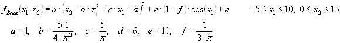

# Дополнительная лабораторная работа 3
## Цель работы
Получние навыков разработки и анализа эволюционных операторов генетического алгоритма для решения задачи оптимизации непрерывной вещественнозначной функции.

<!-- 
## Задачи
* Реализовать Tsp
 -->

## Оборудование и программное обеспечение
- Java JDK версии 1.8 и выше
- Watchmaker framework версии 0.7.1 ([https://github.com/dwdyer/watchmaker](https://github.com/dwdyer/watchmaker))


## Задача

Разработать ГА минимизации функции "Branins's rcos function".



Известно, что данная функция имеет три глобальььных минимума:
f(x1,x2)=0.397887; (x1,x2)=(-pi,12.275), (pi,2.275), (9.42478,2.475)

## Представление решений (TspPositionalSolution)

Решение представлено одномерным массивом типа double размером в 2 элемента

## Мутация

Конструктор мутации принимает три параметра:
* localProbThresh1 - вероятность локальной мутации первого гена
* localProbThresh2 - вероятность локальной мутации второго гена
* globalProbThresh - вероятность, что мутация будет произведена

При этом локальные мутации заключаются в замене значение на новое случайное из соответствующего диапозона.


```java
protected void applyForOneSolution(double[] solution, Random random) {
    int x1_min = -5;
    int x1_max = 10;
    int x2_min = 0;
    int x2_max = 15;

    if (random.nextDouble() < localProbThresh1) {
        solution[0] = getRandomDoubleInRange(random, x1_min, x1_max);
    }

    if (random.nextDouble() < localProbThresh2) {
        solution[1] = getRandomDoubleInRange(random, x2_min, x2_max);
    }
}

public List<double[]> apply(List<double[]> population, Random random) {
    ArrayList<double[]> newPopulation = new ArrayList<double[]>(population.size());

    for (int i=0; i < population.size(); ++i) {

        double[] solution =  population.get(i).clone();
        if (random.nextDouble() < globalProbThresh) {
            applyForOneSolution(solution, random);
        }
        newPopulation.add(solution);
    }
    return population;
}
```

## Кроссовер (TspCrossover)

Кроссинговер возвращает двух потомков от двух родителей. Первый имеет первую коородинату первого родителя, вторую - второго. Второй - наоборот.

```java
protected List<double[]> mate(double[] p1, double[] p2, int crossoverPointsNum, Random random) {

        int dimension = 2;

        double[] child1 = new double[dimension];
        double[] child2 = new double[dimension];

        child1[0] = p1[0];
        child1[1] = p2[1];

        child2[0] = p2[0];
        child2[1] = p1[1];


        ArrayList children = new ArrayList();
        children.add(child1);
        children.add(child2);
        return children;
    }
```

## Результаты экспериментов

| localProbThresh1 | localProbThresh2 | globalProbThresh | crossoverProb | pop. и gen. | результат | решение            |
| :--------------- | :--------------- | :--------------- | :------------ | :---------- | :-------- | :----------------- |
| 0.5              | 0.5              | 0.5              | 0.3           | 1000, 100   | 0.4021    | 3.116149, 2.327932 |
| 0.6              | 0.4              | 0.5              | 0.3           | 1000, 100   | 0.4012    | 3,153453 2,317728  |
| 0.5              | 0.5              | 0.8              | 0.3           | 1000, 100   | 0.4133    | 9,451787 2,388288  |
| 0.5              | 0.5              | 0.01             | 0.8           | 1000, 100   | 0.3991    | 9,418133 2,436978 |
| 0.5              | 0.5              | 0.01             | 0.5           | 1000, 100   | 0.4020    | -3,125694 12,290950 |

Можно заметить, что были найдены все три заявленные глобальные оптимумы