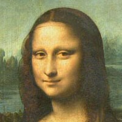
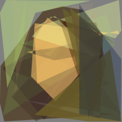
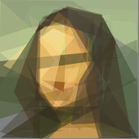
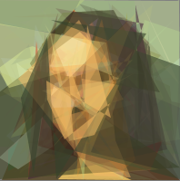

# Лабораторная работа №2. Введение в эволюционные вычисления

## Цель работы
Целью данной лабораторной работы является получение студентом представления об возможностях применения эволюционных алгоритмов для решения различных классов задач и программных средств для их разработки.

## Оборудование и программное обеспечение
- Java JDK версии 1.8 и выше
- Watchmaker framework версии 0.7.1 (добавлено как submodule из [https://github.com/dwdyer/watchmaker](https://github.com/dwdyer/watchmaker))

## Bits Count

[Файл с кодом](./watchmaker/examples/src/java/main/org/uncommons/watchmaker/examples/bits/BitsExample.java)

В данной задаче используется эволюционный алгоритм для максимизации суммы элементов битовой строки. Таким образом, алгоритм должен сойтись на решении, состоящем только из единиц. Было подсчитано сколько итераций (поколений) потребовалось, чтобы найти оптимальное решение для строки длиной 20, 50 и 100. Результаты представлены в таблице ниже.

| Размерность | Run 1     | Run 2     | Run 3     | Run 4     | Run 5     | Среднее   |
| ----------- | --------- | --------- | --------- | --------- | --------- | --------- |
| 20          | 54        | 29        | 29        | 18        | 34        | 36.8      |
| 50          | 2809      | 4339      | 1921      | 2920      | 969       | 2591.6    |
| 100         | 3100603   | 3676999   | 4482144   | 7166198   | 5831047   | 4851398.2 |


## Traveling salesman problem

[Файл с кодом](./watchmaker/examples/src/java/main/org/uncommons/watchmaker/examples/travellingsalesman/TravellingSalesmanApplet.java)

Цель задачи коммивояжера — минимизировать путь, проходящий через все заданные точки (города).

Результаты при исходных параметрах:
```
[Evolution (pop: 300, gen: 100, elite: 3, Truncation Selection (50%))]
ROUTE: Berlin -> Vienna -> Athens -> Rome -> Madrid -> Lisbon -> Dublin -> London -> Paris -> Luxembourg -> Brussels -> Amsterdam -> Copenhagen -> Stockholm -> Helsinki -> Berlin
TOTAL DISTANCE: 10494.0km
(Search Time: 2.741 seconds)
```

Результаты при увеличении популяции до 600
```
[Evolution (pop: 600, gen: 100, elite: 3, Truncation Selection (50%))]
ROUTE: Rome -> Madrid -> Lisbon -> Dublin -> London -> Paris -> Luxembourg -> Brussels -> Amsterdam -> Copenhagen -> Stockholm -> Helsinki -> Berlin -> Vienna -> Athens -> Rome
TOTAL DISTANCE: 10494.0km
(Search Time: 0.417 seconds)
```

Результаты при увеличении числа поколений (итераций) до 200
```
[Evolution (pop: 300, gen: 200, elite: 3, Truncation Selection (50%))]
ROUTE: Berlin -> Helsinki -> Stockholm -> Copenhagen -> Amsterdam -> Brussels -> Luxembourg -> Paris -> London -> Dublin -> Lisbon -> Madrid -> Rome -> Athens -> Vienna -> Berlin
TOTAL DISTANCE: 10494.0km
(Search Time: 0.174 seconds)
```

Результаты при увеличении популяции до 600 и числа поколений (итераций) до 200

```
[Evolution (pop: 600, gen: 200, elite: 3, Truncation Selection (50%))]
ROUTE: Madrid -> Rome -> Athens -> Vienna -> Berlin -> Helsinki -> Stockholm -> Copenhagen -> Amsterdam -> Brussels -> Luxembourg -> Paris -> London -> Dublin -> Lisbon -> Madrid
TOTAL DISTANCE: 10494.0km
(Search Time: 0.43 seconds)
```

Результаты при увеличении числа элитарных объектов до 12:
```
[Evolution (pop: 300, gen: 200, elite: 12, Truncation Selection (50%))]
ROUTE: Vienna -> Athens -> Rome -> Madrid -> Lisbon -> Dublin -> London -> Paris -> Luxembourg -> Brussels -> Amsterdam -> Copenhagen -> Stockholm -> Helsinki -> Berlin -> Vienna
TOTAL DISTANCE: 10494.0km
(Search Time: 0.167 seconds)
```

## Mona Lisa



[Файл с кодом](./watchmaker/examples/src/java/main/org/uncommons/watchmaker/examples/monalisa/MonaLisaApplet.java)

В данной задаче необходимо аппроксимировать картину “Мона Лиза” множеством цветных полигонов.

| Решение | Итерация | Фитнесс | Кол-во полигонов и углов  | Рисунок                                             |
| ------- | -------- | ------- | ------------------------- | --------------------------------------------------- | 
| плохое  | 4490     | 344065  | 14 п, 86 у                |         |
| среднее | 22465    | 213730  | 30 п, 195 у               |   |
| хорошее | 27408    | 209574  | 50 п, 500 у               |       |

## Ответы на вопросы:
1. Типы структур решений:
    * Bits Counts — бинарный
    * Traveling salesman problem — комбинаторный, так как список городов представляет собой перестановку (можно рассматривать и как древовидный, так как список городов определяет граф) 
    * Mona Lisa — комбинатрный

2. Решения в задачи коммивояжера закодированы в виде списка городов в определенном порядке.

3. В задаче Mona Lisa генотип — закодированное множество многоугольников (в данном случае список объектов ColouredPolygon), фенотип — отрендеренное изображение