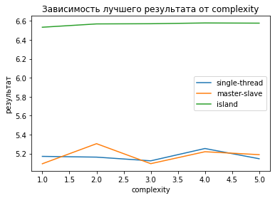

# Лабораторная работа №6. Распределенные эволюционные алгоритмы.

## Цель работы
Освоение принципов построения распределенных и параллельных эволюционных алгоритмов для повышения их производительности и эффективности.

## Оборудование и программное обеспечение
* Использована Java JDK 11
* [Watchmaker framework версии 0.7.1](https://github.com/dwdyer/watchmaker) (требует JDK 1.8 и выше)
* Шаблон проекта: [https://gitlab.com/itmo_ec_labs/lab5](https://gitlab.com/itmo_ec_labs/lab5)

## Условие
* Область определения всех переменных целевой функции: [-5, 5]
* Область определения целевой функции [0, 10]
* Заведомо известно, что глобальный оптимум = 10.

##  Инициализация полпуляции (MyFactory.java)

Инициализация выполняется с помощью генерации случайного числа в интервале [0, 1] типа double методом `random.nextDouble()` и последующей линейной трансформации для изменения диапозона значений.

## Кроссовер (MyCrossover.java)
Так как дискретный кроссовер является частным случаем арифметического, был реализован арифметический. Арифметический кроссовер вычисляется по формуле:

$$z_i = \alpha \cdot x_i+(1-\alpha) \cdot y_i$$

Метод `mate` принимает на вход родителей `p1`, `p2` и число точек, для которых производится кроссовер `crossoverPointsNum`, а также объект `random`. Для каждого дочернего элемента мы копируем в него соответсвующего родителя, генерируем случайным образом индексы, для которых будет произведен кроссовер (число индекссов = `crossoverPointsNum`) и для данных индексов производим вычисление по формуле выше.

Были опробованы различные значения `alpha`. Во всех экспериментах, представленных в данном отчета `alpha` = 0.5 

## Мутация (MyMutation.java)

Была имплементирована равномерная мутация. Каждый ген особи заменяется на новое случайное число с вероятностью `mutation_prob`. На основе незадукументированных эмперических исследований,  оптимальные значения `mutation_prob` для решения задачи данной лабораторной лежат в интервале [0.005, 0.01]. Во всех экспериментах, представленых в данном отчете `mutation_prob` = 0.005.

## Результаты экспериментов

Результаты усреднены по 10 запускам.

Во всех экспериментах были выставлены седующие параметры:
* число генераций: 100
* параметр арифметического кроссовера альфа: 0.5
* вероятность мутации: 0.05
* миграции между островами: 2

dimension = 50, размер популяции = 50

| алгоритм      | complexity | время (ms) | результат |
| :------------ | :--------- | :--------- | :-------- |
| single-thread | 1 | 85 | 5.581|
| single-thread | 2 | 76 | 6.235|
| single-thread | 3 | 97 | 6.136|
| single-thread | 4 | 98 | 5.596|
| single-thread | 5 | 104 | 6.000|
| master-slave | 1 | 88 | 5.812|
| master-slave | 2 | 47 | 5.579|
| master-slave | 3 | 56 | 5.638|
| master-slave | 4 | 106 | 5.934|
| master-slave | 5 | 76 | 6.060|
| island | 1 | 246 | 7.236|
| island | 2 | 153 | 7.258|
| island | 3 | 204 | 7.297|
| island | 4 | 171 | 7.414|
| island | 5 | 174 | 7.043|

  

dimension = 50, размер популяции = 100

|алгоритм     |complexity|время (ms)|результат|
|:------------|:---------|:---------|:--------|
|single-thread|1         |126       |5.170    |
|single-thread|2         |118       |5.162    |
|single-thread|3         |169       |5.123    |
|single-thread|4         |188       |5.253    |
|single-thread|5         |211       |5.145    |
|master-slave |1         |125       |5.092    |
|master-slave |2         |86        |5.304    |
|master-slave |3         |137       |5.093    |
|master-slave |4         |160       |5.219    |
|master-slave |5         |104       |5.188    |
|island       |1         |339       |6.534    |
|island       |2         |307       |6.569    |
|island       |3         |295       |6.571    |
|island       |4         |296       |6.579    |
|island       |5         |337       |6.577    |

  

population size 100, dimension = 100

| алгоритм | complexity | время (ms) | результат |
| :- | :- | :- | :- |
| single-thread | 1 | 335 | 5.098|
| single-thread | 2 | 444 | 5.275|
| single-thread | 3 | 385 | 5.264|
| single-thread | 4 | 364 | 5.442|
| single-thread | 5 | 488 | 5.373|
| master-slave | 1 | 460 | 4.989|
| master-slave | 2 | 327 | 5.191|
| master-slave | 3 | 212 | 5.234|
| master-slave | 4 | 279 | 5.340|
| master-slave | 5 | 307 | 5.300|
| island | 1 | 526 | 5.626|
| island | 2 | 601 | 5.624|
| island | 3 | 679 | 5.703|
| island | 4 | 556 | 5.607|
| island | 5 | 621 | 5.618|

Графики ниже построены для dimension = 50, размер популяции = 100

## Ответы на вопросы
1. Какая модель лучше при каких условиях?

    Single-thread - наиболее быстрое решение, когда фитнес-функция не является наиболее сложной для вычисления составляющей алгоритма.
Когда фитнес-функцию сложнее вычислить островной алгоритм и master-slave работают быстрее single-thread. Практически всегда наилучшее значение фитнес-функции достигается островным алгоритмом. При этом master-slave Обычно быстрее его.

2. Как повлияет увеличение размерности проблемы на алгоритмы?

    Значение фитнесс-функции станет меньше, время выполнения вырастет. Ожидается, что наиболее сильно пострадает островной алгоритм

3. Как повлияет увеличение размера популяции?

    Увеличение размера популяции приведет к более высоким результатам (bestFit), но увеличит время, требуемое на выполнение.

4. Есть ли ограничения для количества островов?

    Во-первых, так как популяции островов "отщипываются" от "общей" популяции, доволбно быстро повышение числа островов становится нецелесообразным (слишком маленькие популяции + перестают оправдоваться накладные расходы). Так же мы ограничены архитектурой процессора, так как ожидается, что каждый отдельным вычислительным узлом / отдельным процессом для праллелизации. 