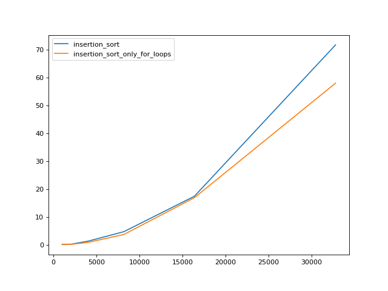
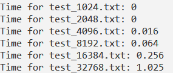

# Сложность алгоритмов и их оптимизация

## Содержимое репозитория:
* generate_tests.py — создет директорию tests.py и файлы с тестовыми данными
* insertion_sort_implementation_and_test.cpp — реализация сортировки вставками на c++ и ее тестирование
* insertion_sort_implementations.py — 2 реализации сортировки ввставками на python
* tester.py тестирование реализаций на python

## Как воспроизвести результаты (Windows)
```
python generate_tests.py (Опционально, так как тесты уже созданы)
python tester.py
g++ -o test.exe insertion_sort_implementation_and_test.cpp
test.exe
```

## Реализовать алгоритм сортировки вставками

Реализация на python:
```python                                       
def insertion_sort(A: Iterable[int], n: int) -> None:
    for j in range(1, n):
        key = A[j]
        i = j - 1
        while i >= 0 and A[i] > key:
            A[i+1] = A[i]
            i = i - 1
        A[i+1] = key
```

### Инвариант цикла:
В начале каждой итерации внешнего цикла for A[0..j-1] состоит из отсортированных исходных элементов данного подмассива

## Сложность алгоритма
Каждая строчка тела обоих циклов занимает константное время.  

Худший для алгоритма случай – входной массив отсортирован по убыванию.

Число итераций внтуреннего цикла для каждой итерации внешнего:
$$0 + 1 + 2 + .. + n-2 = \frac{n \cdot (n-1)}{2}$$

Таким образом, сложность алгоритма $O(n^2)$

## Результаты тестирования

Замена цикла `while` на `for i in range` дала небольшой прирост в скоротси, что видно на графике ниже



Дело в том, что при использовании `while` проверка условия цикла и инкрементация производятся на python, а при `for` - на c.

Но гораздо больший прирост в скорости (в среднем по всем тестам примерно в 60 раз) дало переписывание алгоритма на c++

